<p align="center">
  <h1 align="center">🔍 TriageHound</h1>
  <p align="center">
    <strong>Cross-Platform Digital Forensics & Incident Response Toolkit</strong><br>
    <em>Collect. Correlate. Detect. Reason. Prioritize. Explain.</em>
  </p>
  <p align="center">
    
    
    
    
    
  </p>
</p>

---

**TriageHound** is a modular, standalone Incident Response toolkit for rapid live-system triage, advanced forensic artifact collection, and automated threat hunting. Originally built for Windows, it now features native support for **Windows**, **macOS**, and **Linux**.

It gathers volatile data, parses deep file-system artifacts (like USN Journals, FSEvents, and in-memory drops) to defeat anti-forensics, scans for malicious indicators using **YARA** and **Sigma** rules, and generates a **cryptographically sealed PDF report** for legal chain-of-custody.

> **Why "TriageHound"?** — In Incident Response, *triage* is the first 30 minutes on a compromised machine. Like a bloodhound tracking a scent, TriageHound follows every trace an attacker left behind — even the ones they tried to destroy.

---

## 🏗️ Architecture Pipeline

```mermaid
flowchart TB
    %% ── Styles ──────────────────────────────────────────────
    classDef entrypoint fill:#0d1117,stroke:#58a6ff,stroke-width:2px,color:#e6edf3,font-weight:bold
    classDef winNode fill:#0f1d2e,stroke:#3b82f6,stroke-width:1.5px,color:#93c5fd
    classDef macNode fill:#0f1d2e,stroke:#a78bfa,stroke-width:1.5px,color:#c4b5fd
    classDef linNode fill:#0f1d2e,stroke:#fbbf24,stroke-width:1.5px,color:#fde68a
    classDef dbNode fill:#1a1a2e,stroke:#6366f1,stroke-width:2px,color:#a5b4fc,font-weight:bold
    classDef intelNode fill:#0b1e0b,stroke:#10b981,stroke-width:1.5px,color:#6ee7b7
    classDef threatNode fill:#1e0b1e,stroke:#ec4899,stroke-width:1.5px,color:#f9a8d4
    classDef outputNode fill:#1e1a0b,stroke:#f59e0b,stroke-width:1.5px,color:#fcd34d
    classDef sealNode fill:#0d1117,stroke:#ef4444,stroke-width:2px,color:#fca5a5,font-weight:bold

    %% ── Entry ───────────────────────────────────────────────
    GUI["🖥️ TriageHound GUI / CLI<br/>Case ID • Examiner • Output Path"]:::entrypoint
    DETECT{"🔎 Platform Detection<br/>Windows │ macOS │ Linux"}:::entrypoint

    GUI --> DETECT

    %% ── Windows Collection ──────────────────────────────────
    subgraph WIN["🪟 Windows v1.0 — Artifact Collection"]
        direction LR
        W1["Prefetch (.pf)"]:::winNode
        W2["ShimCache"]:::winNode
        W3["USN Journal"]:::winNode
        W4["Event Logs (.evtx)"]:::winNode
        W5["Processes & Startup"]:::winNode
        W6["USB & Browser History"]:::winNode
    end

    %% ── macOS Collection ────────────────────────────────────
    subgraph MAC["🍎 macOS v2.0 — Artifact Collection"]
        direction LR
        M1["Unified Logs"]:::macNode
        M2["FSEvents"]:::macNode
        M3["KnowledgeC"]:::macNode
        M4["QuarantineEvents"]:::macNode
        M5["LaunchDaemons"]:::macNode
        M6["Browser & Telemetry"]:::macNode
    end

    %% ── Linux Collection ────────────────────────────────────
    subgraph LIN["🐧 Linux v3.0 — Artifact Collection"]
        direction LR
        L1["Syslog & Auth Logs"]:::linNode
        L2["Shell History"]:::linNode
        L3["Cron & Systemd"]:::linNode
        L4["/dev/shm Drops"]:::linNode
        L5["SUID Binaries"]:::linNode
        L6["Persistence Checks"]:::linNode
    end

    DETECT -->|"os == Windows"| WIN
    DETECT -->|"os == Darwin"| MAC
    DETECT -->|"os == Linux"| LIN

    %% ── Central Database ────────────────────────────────────
    DB[("🗄️ SQLite Forensic Database<br/>Timestamped • Case-Linked")]:::dbNode

    WIN --> DB
    MAC --> DB
    LIN --> DB

    %% ── Threat Hunting ──────────────────────────────────────
    subgraph THREAT["🎯 Automated Threat Hunting"]
        direction LR
        TH1["YARA Engine<br/>Malware Signatures"]:::threatNode
        TH2["Sigma Engine<br/>Behavioral Rules"]:::threatNode
        TH3["VirusTotal API<br/>70+ AV Engines"]:::threatNode
    end

    DB --> THREAT

    %% ── Intelligence Pipeline ───────────────────────────────
    subgraph INTEL["🧠 v1.0 Intelligence Pipeline"]
        direction TB
        I1["Evidence Normalization<br/>Unified Process & File Entities"]:::intelNode
        I2["Cross-Artifact Correlation<br/>Link Prefetch ↔ ShimCache ↔ USN ↔ EVTX"]:::intelNode
        I3["Anti-Forensics Detection<br/>Missing EXEs • Rapid Deletes • Log Gaps"]:::intelNode
        I4["Attack Chain Reconstruction<br/>Delivery → Execution → Persistence → Exfil"]:::intelNode
        I5["Confidence Scoring<br/>Explainable 0–100 Compromise Score"]:::intelNode
        I6["Investigation Findings<br/>Structured Verdicts + Recommended Actions"]:::intelNode
        I1 --> I2 --> I3 --> I4 --> I5 --> I6
    end

    DB --> INTEL
    THREAT -.->|"feeds into"| I2
    THREAT -.->|"feeds into"| I5

    %% ── Output ──────────────────────────────────────────────
    subgraph OUTPUT["📄 Output & Legal Defensibility"]
        direction LR
        O1["Professional PDF Report<br/>Cover Page • Executive Summary • Details"]:::outputNode
        O2["Super Timeline<br/>Unified Chronological View"]:::outputNode
        O3["JSON / CSV Export<br/>SIEM-Ready Data"]:::outputNode
    end

    INTEL --> OUTPUT
    THREAT --> OUTPUT

    %% ── Crypto Seal ─────────────────────────────────────────
    SEAL["🔒 SHA-256 Cryptographic Seal<br/>Chain-of-Custody Manifest • Court-Admissible"]:::sealNode

    OUTPUT --> SEAL
```

---

## 📑 Table of Contents

- [Key Features](#-key-features)
- [Case Study: Insider Threat Walkthrough](#-case-study-insider-threat-walkthrough)
- [Screenshots](#-screenshots)
- [Quick Start](#-quick-start)
- [CLI Reference](#-cli-reference)
- [Project Architecture](#-project-architecture)
- [Sigma & YARA Rule Library](#-sigma--yara-rule-library)
- [Known Limitations & Error Handling](#-known-limitations--error-handling)
- [Environment & Compatibility](#-environment--compatibility)
- [License & Legal](#-license--legal)

---

## 🔥 Key Features

### Overlapping Artifact Collection (Anti-Forensics Resilience)

Real attackers don't leave evidence lying around. They delete malware, wipe Prefetch files, and clear event logs. TriageHound defeats this by collecting **redundant, overlapping proof** from multiple independent sources across all operating systems:

| OS | Artifact | What It Proves | Survives Deletion Of... |
|---|---|---|---|
| **Windows (v1.0)** | Prefetch (`.pf`) | Program execution, run count | — |
| | ShimCache | Executable was shimmed by OS | Prefetch files |
| | USN Journal (`$J`) | File created/modified/deleted | Prefetch + ShimCache |
| **macOS (v2.0)** | KnowledgeC | App usage, duration | — |
| | QuarantineEvents | Files downloaded from web | Browser history |
| | FSEvents | File creations/deletions | Application logs |
| **Linux (v3.0)** | Shell History | Commands run (`.bash_history`) | — |
| | In-Memory Drops | Reverse shells run from `/dev/shm` | Disk wiping |
| | SUID Binaries | Persistence mechanisms | `auth.log` clearing |

> 💡 **This is the single biggest differentiator.** Most forensic tools only collect one of these. TriageHound collects them all, so even if an attacker defeats one artifact, the others still convict them.

### Automated Threat Hunting

| Engine | What It Does |
|---|---|
| **YARA** | Scans startup executables against malware signature rules (`.yar`) |
| **Sigma** | Evaluates Windows Event Logs against behavioral detection rules (`.yml`) |
| **VirusTotal** | Hashes processes/startup files → queries 70+ AV engines via API |

### v1.0 Intelligence Engines (NEW)

| Engine | What It Does |
|---|---|
| **Evidence Normalization** | Standardizes artifacts into unified `Process` and `File` entities |
| **Cross-Artifact Correlation** | Links related evidence across Prefetch, ShimCache, USN, and Event Logs |
| **Confidence Scoring** | Assigns an explainable 0-100 Endpoint Compromise Confidence Score |
| **Anti-Forensics Detection** | Detects evidence tampering: missing executables, rapid deletions, log clearing |
| **Attack Chain Reconstruction** | Builds a sequential narrative of the attack (e.g., PowerShell → Executable → Persistence) |
| **Investigation Findings** | Consolidates all intelligence into structured findings with recommended actions |

### Core Evidence Collection

- **Windows (v1.0)**: Running Processes, Registry Startup, USB History, Event Logs, Prefetch, USN Journal
- **macOS (v2.0)**: Unified Logs (`log show`), LaunchDaemons/Agents, FSEvents, QuarantineEvents, KnowledgeC
- **Linux (v3.0)**: Syslog/Auth logs, `.bash_history` (all users), Cron jobs, Systemd services, `/dev/shm` drops, SUID binaries

### Chain of Custody & Legal Defensibility

- **SHA-256 Cryptographic Sealing** — The final PDF report and SQLite database are hashed. A `seal_<CASE>.txt` manifest is generated so any tampering is instantly detectable in court.
- **Super Timeline** — All timestamps from every module are merged into a single chronological timeline, exportable to JSON/CSV.

### 📦 Standalone USB Packaging (GitHub Actions CI/CD)

TriageHound uses GitHub Actions to automatically compile standalone executables for all three operating systems. **No Python required on the target machine.**
1. Plug USB into target machine.
2. Run `TriageHound-Windows-v1.0.exe`, `TriageHound-Mac-v2.0`, or `TriageHound-Linux-v3.0`.
3. Extract the cryptographically sealed report.

---

## 🕵️ Case Study: Insider Threat Walkthrough

> *This fictional scenario demonstrates TriageHound's capabilities against a realistic insider threat with anti-forensic countermeasures.*

### The Scenario

An employee at a financial firm is suspected of stealing sensitive client data. Before leaving the office, they:

1. ✅ Copied confidential `.xlsx` files to a personal USB drive.
2. 🗑️ Deleted the copied files from the desktop.
3. 🧹 Cleared the Windows Security Event Log to hide their tracks.
4. 🔥 Deleted the Prefetch files for `explorer.exe` and `xcopy.exe` to hide execution evidence.

The IR team plugs in a USB drive containing `TriageHound.exe` and runs a full triage.

### What TriageHound Finds

| Module | Evidence Recovered | Anti-Forensics Defeated? |
|---|---|---|
| **USB History** | Serial number `SanDisk_Ultra_4C530001231018` connected at 17:42 | N/A — attacker didn't wipe this |
| **Prefetch** | ❌ Empty — attacker deleted `.pf` files | Attacker wins this round |
| **ShimCache** | `xcopy.exe` found at cache position #3, last modified 17:38 | ✅ **Defeats Prefetch deletion** |
| **USN Journal** | `FILE_DELETE` entry for `client_financials_Q4.xlsx` at 17:45 | ✅ **Proves the file existed and was deleted** |
| **Sigma Engine** | 🚨 **CRITICAL: "Security Event Log Cleared" (Event ID 1102)** at 17:50 | ✅ **Catches the cover-up attempt** |
| **YARA** | No malware detected (this was insider theft, not malware) | N/A |

### The Verdict

Despite the attacker deleting Prefetch files AND clearing event logs, TriageHound reconstructed the full incident:

> *"At 17:38, `xcopy.exe` was executed (ShimCache). At 17:42, USB device `SanDisk_Ultra_4C530001231018` was connected. At 17:45, `client_financials_Q4.xlsx` was deleted from disk (USN Journal). At 17:50, the Security Event Log was cleared (Sigma Alert). The SHA-256 sealed report and database provide a tamper-evident evidence package for legal proceedings."*

**This is the story you tell in an interview.**

---

## 📸 Screenshots

> Real screenshots captured from live triage sessions on all three supported platforms.

---

### 🪟 Windows v1.0

**GUI — Collection Log (Investigation Running)**
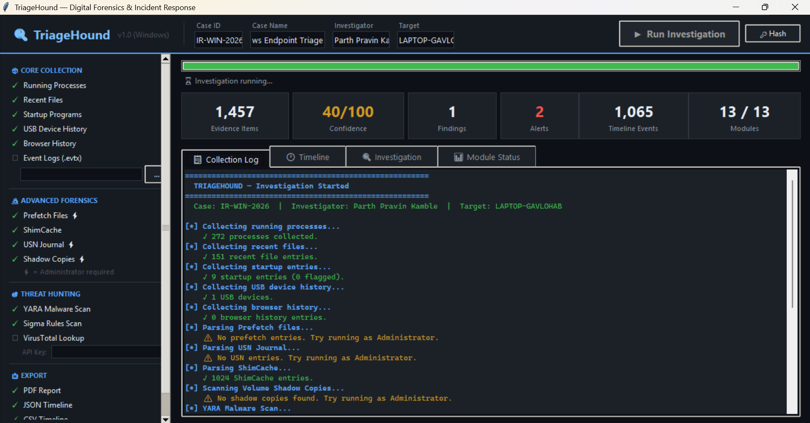

**GUI — Super Timeline (ShimCache Entries)**
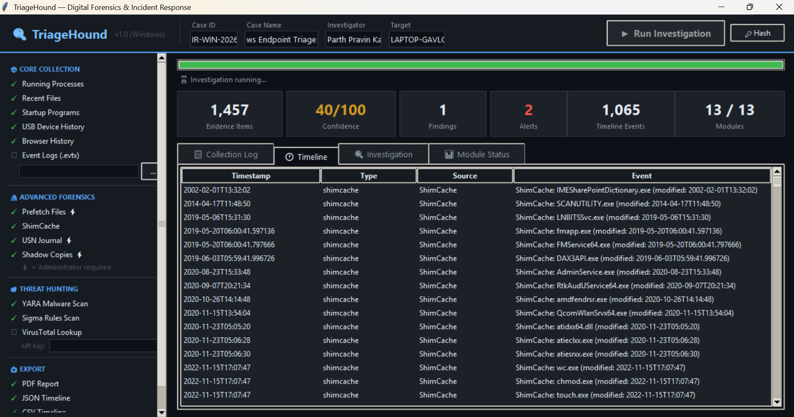

**GUI — Investigation Summary (40/100 MEDIUM — PowerShell Detected)**
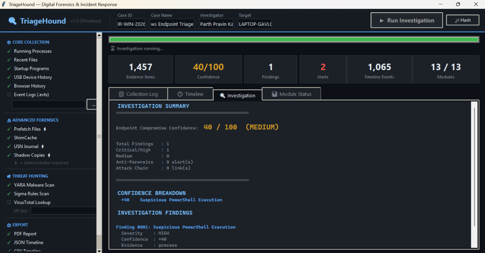

**GUI — Module Status (13/13 Done)**
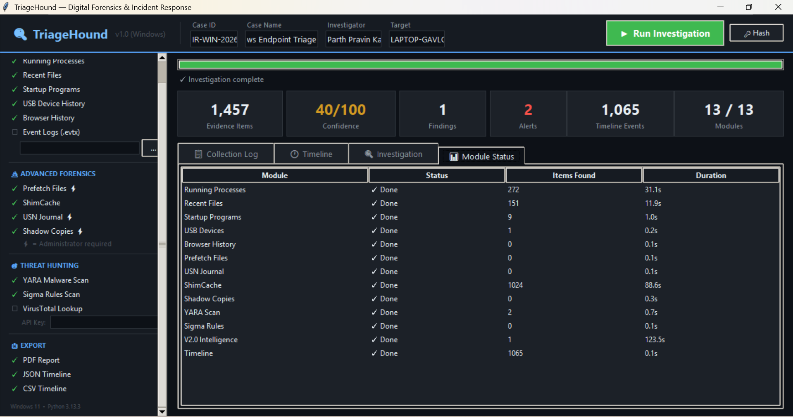

**📄 PDF Report** — [IR-WIN-2026\_Windows\_Endpoint\_Triage.pdf](screenshots/Windows/IR-WIN-2026_Windows_Endpoint_Triage.pdf)

---

### 🍎 macOS v2.0

**GUI — Collection Log (Investigation Complete, 50/100 MEDIUM)**
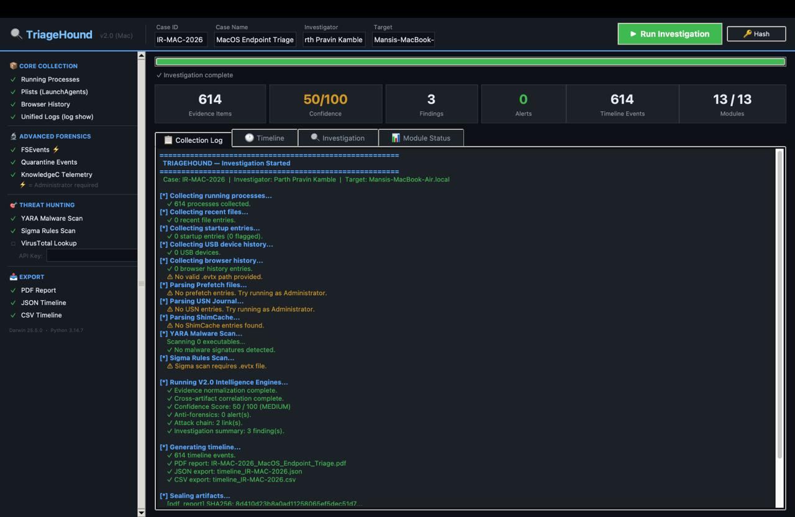

**GUI — Super Timeline (Live Processes)**
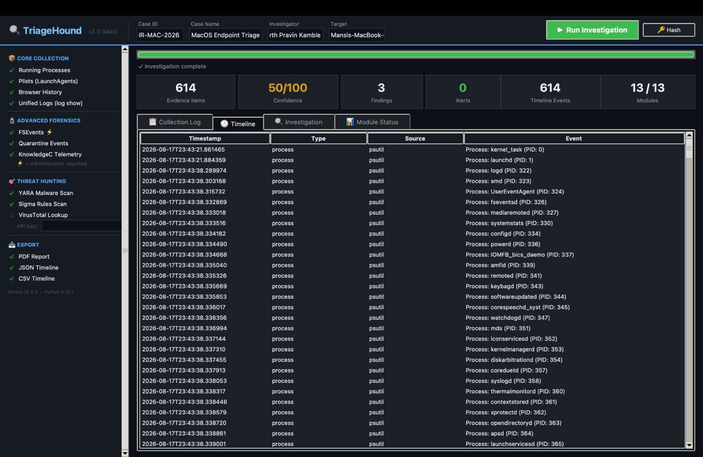

**GUI — Investigation Summary (3 Findings — LaunchAgent + zsh + python Detected)**
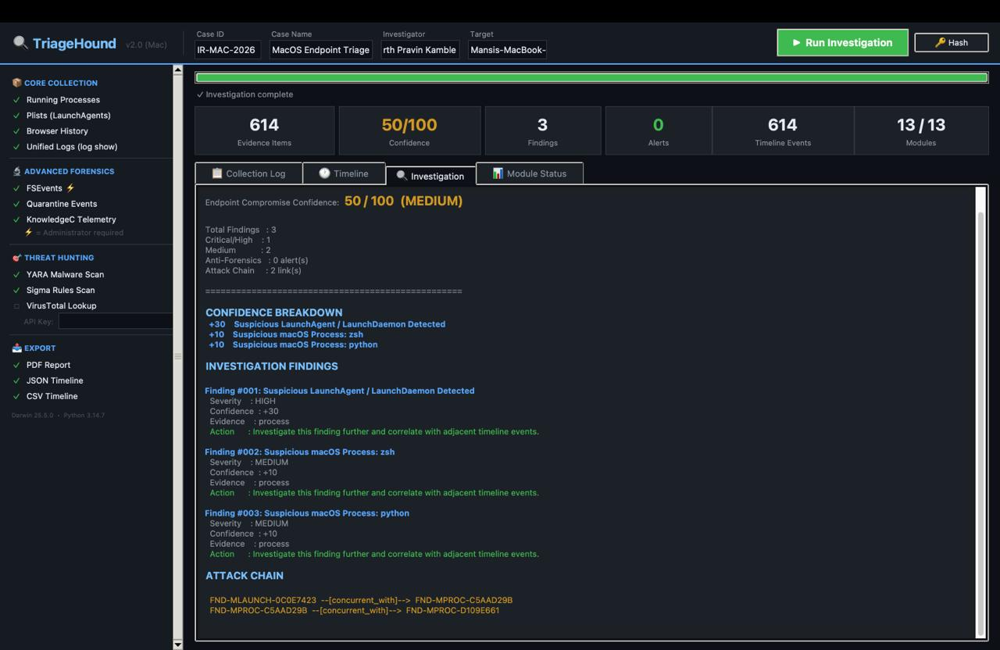

**GUI — Module Status (13/13 Done)**
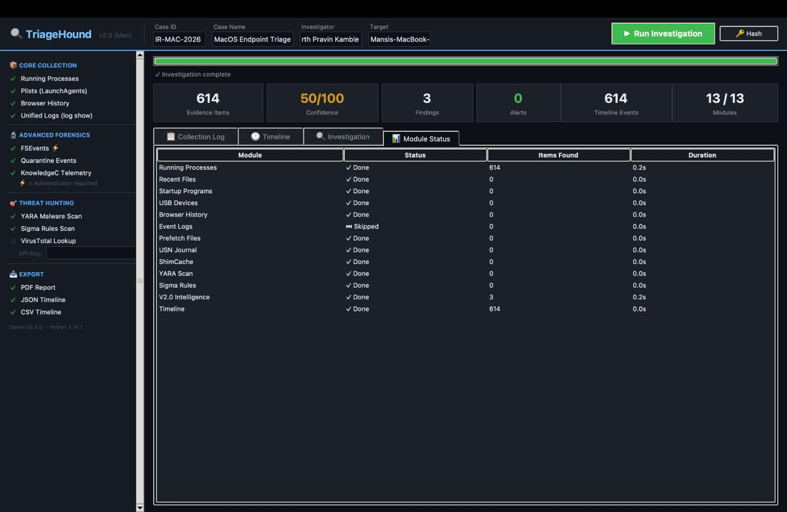

**📄 PDF Report** — [IR-MAC-2026\_MacOS\_Endpoint\_Triage.pdf](screenshots/MAC/IR-MAC-2026_MacOS_Endpoint_Triage.pdf)

---

### 🐧 Linux v3.0

**CLI — Setup & Installation (git clone + pip install)**
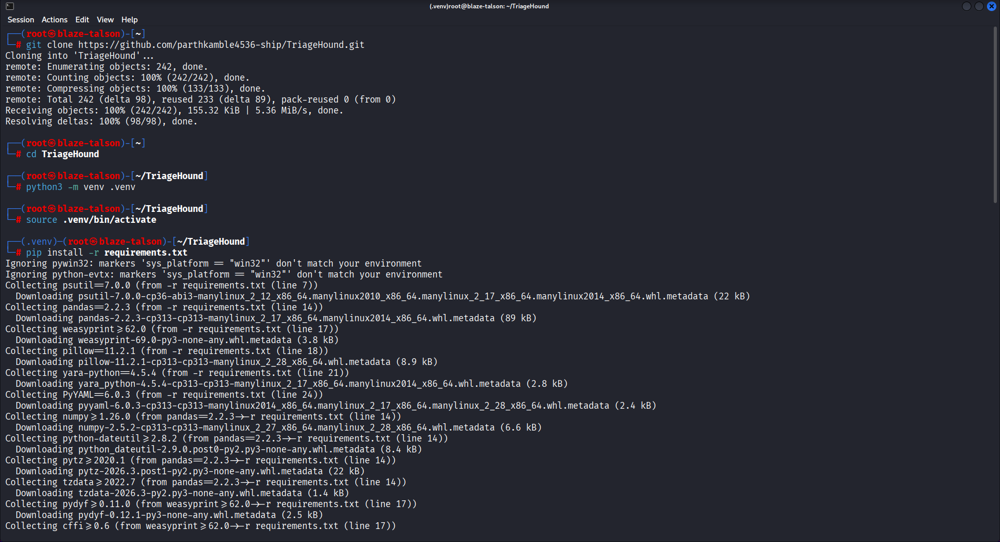

**GUI — Collection Log (Investigation Complete, 20/100 LOW)**
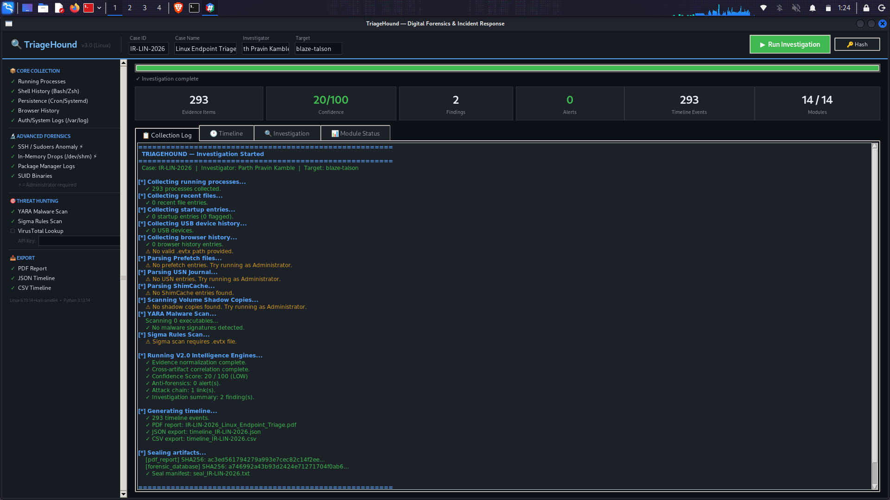

**GUI — Super Timeline (Running Processes)**
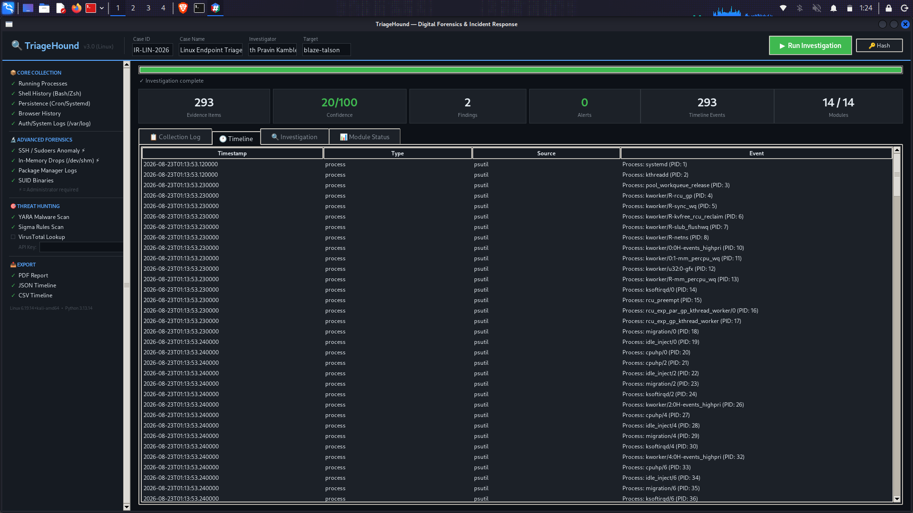

**GUI — Investigation Summary (2 Findings — Attack Chain Detected)**
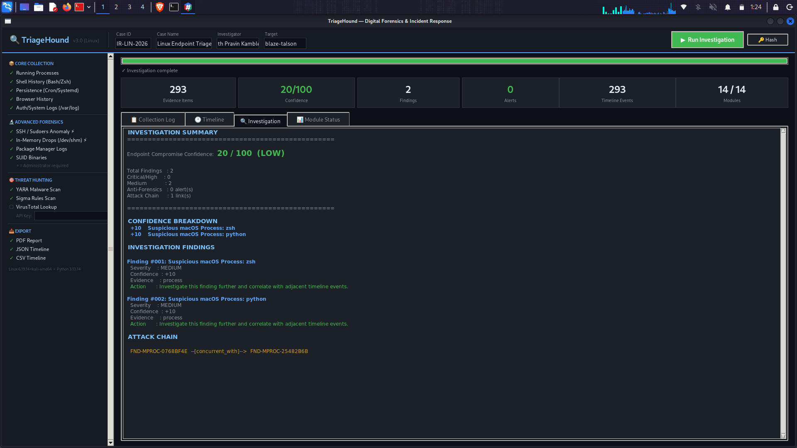

**GUI — Module Status (14/14 Done)**
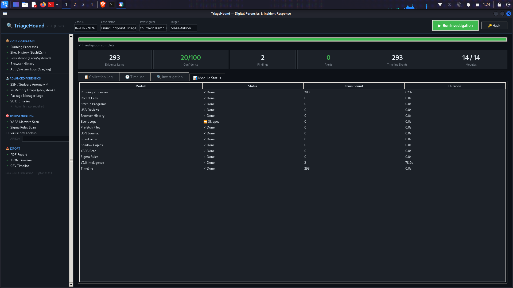

**📄 PDF Report** — [IR-LIN-2026\_Linux\_Endpoint\_Triage.pdf](screenshots/Linux/IR-LIN-2026_Linux_Endpoint_Triage.pdf)

---


## 🚀 Quick Start

### Option 1: Standalone USB Version (Recommended for Responders)
Go to the **Releases** tab on GitHub and download the compiled binary for your target OS.
- `TriageHound-Windows-v1.0.exe` (Run as Administrator)
- `TriageHound-Mac-v2.0` (Run with `sudo` / Full Disk Access)
- `TriageHound-Linux-v3.0` (Run with `sudo`)

No installation required. Just plug in your USB and run.

### Option 2: Run from Source (For Students/Researchers)

Requires Python 3.11+.

```bash
# 1. Clone the repository
git clone https://github.com/parthkamble4536-ship/TriageHound.git
cd TriageHound

# 2. (Optional) Create a virtual environment
python -m venv .venv
source .venv/bin/activate  # Or .venv\Scripts\activate on Windows

# 3. Install dependencies
pip install -r requirements.txt

# 4. Launch the GUI
python gui.py
```

---

## 📂 Output Structure

After every investigation, **all reports are saved in one place** — the `Generated_Reports/` folder inside the TriageHound directory. Each case gets its own dedicated subfolder named after the Case ID you entered in the GUI.

```
TriageHound/
└── Generated_Reports/
    ├── IR-WIN-2025/                        ← Windows investigation
    │   ├── IR-WIN-2025_Windows_Endpoint_Triage.pdf
    │   ├── timeline_IR-WIN-2025.json
    │   ├── timeline_IR-WIN-2025.csv
    │   └── seal_IR-WIN-2025.txt            ← SHA-256 chain-of-custody seal
    │
    ├── IR-MAC-2026/                        ← macOS investigation
    │   ├── IR-MAC-2026_macOS_Endpoint_Triage.pdf
    │   ├── timeline_IR-MAC-2026.json
    │   └── seal_IR-MAC-2026.txt
    │
    └── IR-LIN-2025/                        ← Linux investigation
        ├── IR-LIN-2025_Linux_Endpoint_Triage.pdf
        ├── timeline_IR-LIN-2025.json
        └── seal_IR-LIN-2025.txt
```

### 📥 Open or Export the PDF

| OS | Command |
|---|---|
| **Windows** | `start Generated_Reports\IR-WIN-2025\IR-WIN-2025_Windows_Endpoint_Triage.pdf` |
| **macOS** | `open ~/TriageHound/Generated_Reports/IR-MAC-2026/IR-MAC-2026_macOS_Endpoint_Triage.pdf` |
| **Linux** | `xdg-open ~/TriageHound/Generated_Reports/IR-LIN-2025/IR-LIN-2025_Linux_Endpoint_Triage.pdf` |

Copy to Downloads for easy sharing:

```bash
# macOS
cp ~/TriageHound/Generated_Reports/IR-MAC-2026/*.pdf ~/Downloads/

# Linux
cp ~/TriageHound/Generated_Reports/IR-LIN-2025/*.pdf ~/Downloads/

# Windows (PowerShell)
Copy-Item "Generated_Reports\IR-WIN-2025\*.pdf" "$env:USERPROFILE\Downloads\"
```

---


```bash
python main.py --case <CASE_ID> --investigator <NAME> --target <HOSTNAME> [OPTIONS]
```

| Flag | Description | Requires Admin? |
|---|---|---|
| `--case` | Unique case identifier (required) | No |
| `--investigator` | Analyst name for the report (required) | No |
| `--target` | Target system hostname (required) | No |
| `--yara-scan` | Scan startup executables against YARA rules | No |
| `--rules-dir <path>` | Custom YARA rules directory (default: `rules/`) | No |
| `--prefetch` | Parse Windows Prefetch files | **Yes** |
| `--shimcache` | Parse ShimCache (AppCompatCache) from registry | No |
| `--usn-journal` | Parse NTFS USN Journal for file system changes | **Yes** |
| `--evtx <path>` | Parse a Windows Event Log file (`.evtx`) | No |
| `--sigma-scan` | Run Sigma rules against parsed event logs | No (requires `--evtx`) |
| `--vt-api-key <key>` | VirusTotal API key for hash reputation lookups | No |
| `--vss` | Scan Volume Shadow Copies for deleted evidence | **Yes** |
| `--export-json` | Export timeline to JSON | No |
| `--export-csv` | Export timeline to CSV | No |

### Example: Full Investigation (as Administrator)

```powershell
python main.py --case INC-2026-042 `
    --investigator "Jane Doe" `
    --target "SRV-EXCHANGE-01" `
    --yara-scan --prefetch --shimcache --usn-journal `
    --evtx "C:\Windows\System32\winevt\Logs\Security.evtx" `
    --sigma-scan `
    --vt-api-key "YOUR_VT_API_KEY_HERE" `
    --export-json
```

---

## 🏗️ Project Architecture

```
TriageHound/
├── main.py                  # CLI entry point (headless automation)
├── gui.py                   # Multi-threaded Tkinter GUI
├── requirements.txt         # Version-pinned dependencies
├── DF_Toolkit.spec          # PyInstaller build spec
├── build_exe.ps1            # One-click .exe build script
│
├── modules/                 # Collection & analysis modules
│   ├── process_monitor.py   # Running processes (psutil)
│   ├── browser_analysis.py  # Browser history (Chrome/Edge/Firefox)
│   │
│   ├── Windows (v1.0)
│   │   ├── recent_files.py      # Registry: Recent Docs
│   │   ├── startup_analysis.py  # Registry: Run Keys
│   │   ├── usb_analysis.py      # Registry: USBSTOR
│   │   ├── event_logs.py        # WinEvtx parser
│   │   ├── prefetch_parser.py   # C:\Windows\Prefetch
│   │   ├── shimcache_parser.py  # AppCompatCache
│   │   └── usn_parser.py        # NTFS $UsnJrnl:$J
│   │
│   ├── macOS (v2.0)
│   │   ├── mac_unified_logs.py  # log show
│   │   ├── mac_persistence.py   # LaunchDaemons/Agents
│   │   ├── mac_fsevents.py      # /.fseventsd/
│   │   └── mac_telemetry.py     # Quarantine & KnowledgeC
│   │
│   ├── Linux (v3.0)
│   │   ├── linux_system_logs.py # syslog / auth.log
│   │   ├── linux_shell_history.py # bash/zsh history
│   │   ├── linux_persistence.py # cron, systemd, SUID
│   │   └── linux_memory_drops.py # /tmp, /dev/shm drops
│   │
│   ├── Engine Layer
│   │   ├── normalization.py     # Standardizes OS artifacts
│   │   ├── correlation_engine.py# Links related evidence
│   │   ├── confidence_engine.py # Scores compromise (0-100)
│   │   ├── anti_forensics.py    # Detects tampering
│   │   ├── attack_chain.py      # Builds chronological narrative
│   │   └── findings_engine.py   # Generates human-readable summaries
│   │
│   ├── volume_shadow.py     # VSS snapshot evidence recovery
│   ├── yara_scanner.py      # YARA rule compiler & scanner
│   ├── sigma_engine.py      # Lightweight Sigma rule matcher
│   ├── virustotal.py        # VirusTotal API v3 integration
│   ├── hashing.py           # MD5/SHA1/SHA256 file hashing
│   ├── report_sealer.py     # SHA-256 cryptographic sealing
│   └── timeline.py          # Chronological timeline generator
│
├── database/
│   ├── db_manager.py        # SQLite ORM for evidence storage
│   └── schema.sql           # Database schema
│
├── reports/
│   └── report_generator.py  # Professional dark-themed PDF (ReportLab)
│
├── rules/                   # YARA malware signature rules (.yar)
│   └── sample_rules.yar
│
├── sigma_rules/             # Sigma behavioral detection rules (.yml)
│   ├── event_log_clearing.yml
│   ├── new_service_installed.yml
│   ├── scheduled_task_created.yml
│   ├── rdp_login.yml
│   └── user_account_created.yml
│
└── utils/
    └── helpers.py           # JSON/CSV export utilities
```

---

## 🛡️ Sigma & YARA Rule Library

### Sigma Rules (Behavioral Detection on Event Logs)

| Rule File | What It Detects | Severity | Why It Matters |
|---|---|---|---|
| `event_log_clearing.yml` | Security Event Log cleared (Event ID 1102) | **CRITICAL** | Classic anti-forensics — attacker trying to destroy evidence |
| `new_service_installed.yml` | New Windows service created (Event ID 7045) | HIGH | Common persistence mechanism for backdoors |
| `scheduled_task_created.yml` | Scheduled task registered (Event ID 4698) | HIGH | Persistence technique to survive reboots |
| `rdp_login.yml` | Remote Desktop login detected (Event ID 4624, Type 10) | MEDIUM | May indicate lateral movement within the network |
| `user_account_created.yml` | New local user account created (Event ID 4720) | HIGH | Attackers create backdoor accounts for persistent access |

### YARA Rules (Malware Signature Scanning)

| Rule | What It Detects | Severity |
|---|---|---|
| `SuspiciousPersistenceMechanism` | Executables with Run key or service-related strings | MEDIUM |
| `SuspiciousKeylogger` | Binaries containing keyboard hook API calls | HIGH |

> 💡 **Extend these!** Add your own `.yar` and `.yml` files to the `rules/` and `sigma_rules/` directories. TriageHound auto-discovers and loads them.

---

## ⚠️ Known Limitations & Error Handling

TriageHound is designed to **degrade gracefully**. If a module cannot access an artifact due to permissions or system configuration, it logs a warning and continues collecting everything else.

| Scenario | Behavior |
|---|---|
| **Not running as Administrator** | USN Journal, Prefetch, and VSS modules return empty results with a warning. All other modules (ShimCache, processes, browser, USB, YARA) work normally. |
| **USN Journal is disabled on target** | `collect_usn_journal()` returns an empty list. No crash. |
| **No `.evtx` file provided** | Sigma scan is skipped with a warning message. |
| **VirusTotal API rate limit hit** | Module auto-throttles to 4 requests/minute (free tier). Returns `rate_limited` status for excess hashes. |
| **VSS mount fails (permissions)** | `mount_shadow()` returns `False`. The shadow copy is skipped; others continue. |
| **`yara-python` not installed** | YARA scan is skipped entirely. A warning is printed. |
| **`pyyaml` not installed** | Sigma engine is skipped entirely. A warning is printed. |
| **Target has no shadow copies** | VSS module returns empty list. No crash. |
| **Corrupted Prefetch file** | Individual file is skipped via try/except. Other files continue parsing. |
| **False Positives (OneDrive / Docker)** | The Intelligence Engine intentionally flags *any* dropped executable or background persistence mechanism. On personal machines, legitimate software (like OneDrive updaters or Docker proxies) that mimic malware behaviors (dropping `.exe` files into hidden folders, running with high privileges) will be flagged as "Suspicious" with a Medium/High severity. |

---

## 🚀 Future Scope & Roadmap

As TriageHound continues to evolve, the following enterprise-grade features are planned for future releases:

- **Intelligent Whitelisting & Tuning**: Implementation of a Cryptographic Signature Verification engine. If a dropped executable or persistence mechanism is digitally signed by a trusted vendor (e.g., Microsoft Corporation, Docker Inc., Google LLC), the Intelligence Engine will automatically whitelist it to drastically reduce false positives in SOC environments.
- **Remote Agent Deployment**: Ability to deploy TriageHound headless agents across an Active Directory domain via WinRM or SSH for enterprise-wide sweeps.
- **Memory Forensics Integration**: Automated Volatility3 integration to dump and parse active RAM for rootkits and injected threads.

---

## 🖥️ Environment & Compatibility

| Requirement | Supported |
|---|---|
| **Operating System** | Windows 10 (build 1809+), Windows 11 |
| **Python Version** | 3.11, 3.12, 3.13 |
| **Architecture** | x86-64 (64-bit) |
| **Privileges** | Standard user (partial collection) or Administrator (full collection) |
| **Disk Format** | NTFS (required for USN Journal and Prefetch) |

### Dependencies

All dependencies are version-pinned in `requirements.txt` for reproducible builds:

```
psutil==7.0.0          # Process enumeration
pywin32==310           # Windows Registry & API access
python-evtx==0.8.1     # Event Log (.evtx) parsing
pandas==2.2.3          # Timeline data handling
reportlab==5.0.0       # PDF report generation
pillow==11.2.1         # Image support for ReportLab
yara-python==4.5.4     # YARA malware scanning
PyYAML==6.0.3          # Sigma rule parsing
```

---

## 📜 License & Legal

This project is licensed under the **MIT License** — see the [LICENSE](LICENSE) file for details.

### Authorized Use Only

TriageHound is a forensic investigation tool that accesses raw disk volumes, registry hives, and active system memory. **It must only be used on systems you own or are explicitly authorized to investigate.**

Unauthorized use of this tool on systems you do not own or have permission to investigate may violate local, state, and federal laws including but not limited to the Computer Fraud and Abuse Act (CFAA).

### Evidence Integrity

The SHA-256 cryptographic sealing feature provides tamper-evidence for collected artifacts. However, this tool is provided "as-is" and the authors make no guarantees about the admissibility of collected evidence in any legal proceeding. Always consult with legal counsel regarding evidence handling procedures in your jurisdiction.

---

## 🤝 Contributing

Contributions are welcome! To add new collection modules:

1. Create a new file in `modules/` following the `collect_*()` → `list[dict]` pattern.
2. Register the module in `main.py` (CLI flag) and `gui.py` (checkbox).
3. Add a report section in `reports/report_generator.py`.
4. Insert evidence via `db.insert_evidence()` using a unique `artifact_type`.

To add new detection rules:
- **YARA**: Drop `.yar` files into `rules/`
- **Sigma**: Drop `.yml` files into `sigma_rules/`

Both are auto-discovered at runtime.

---

<p align="center">
  <strong>Built for the front lines of Incident Response.</strong><br>
  <em>TriageHound — Because attackers delete evidence. We find it anyway.</em>
</p>
