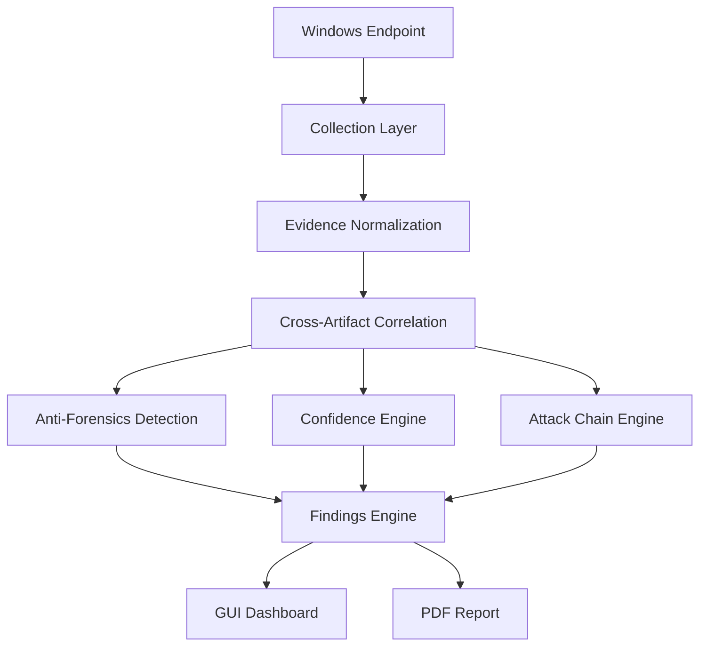

# 02 - Architecture

## High-Level Pipeline

The TriageHound v2.0 pipeline transforms fragmented artifacts into correlated findings.

## Core Layers
1. **Collection Layer:** Extracts raw forensic artifacts (Prefetch, USN, Event Logs, etc.).
2. **Normalization Layer:** Converts diverse artifacts into standard entities (Process, File, User).
3. **Correlation Engine:** Links related entities into a single investigation finding.
4. **Reasoning Engines (Anti-Forensics, Confidence, Attack Chain):** Analyzes findings to apply weights, detect tampering, and build timelines.
5. **Findings Engine:** Packages the correlated data and reasoning into human-readable outputs for the GUI and PDF.
