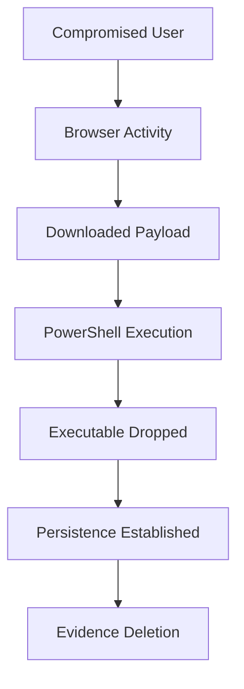

# 09 - Attack Chain Reconstruction

Instead of presenting an analyst with a flat timeline of events, this engine attempts to reconstruct the narrative of the attack.

## Methodology
By leveraging the correlated findings, the engine builds a sequential, graphical chain.

## Example Flow
Instead of:
```text
14:01 Event
14:02 Process
14:03 File
```

The engine builds:


This visual chain provides an immediate, high-level understanding of the incident's scope.
